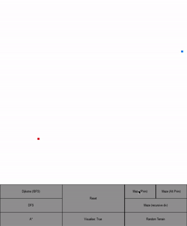
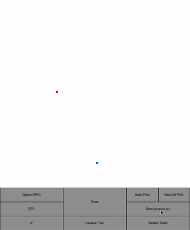
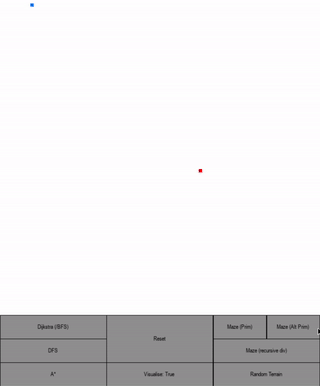
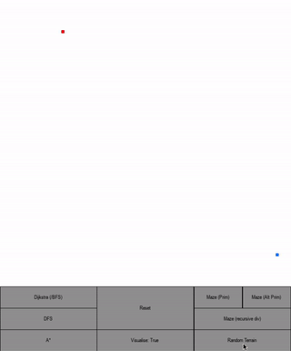
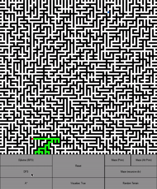
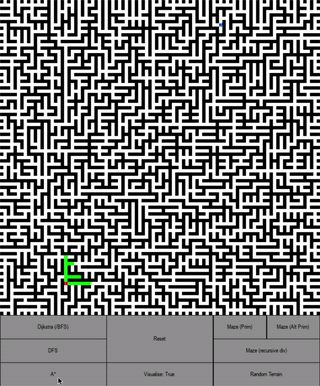
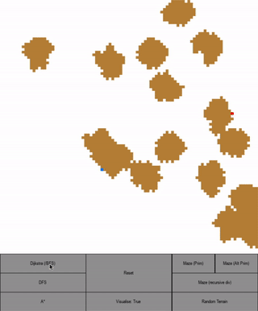
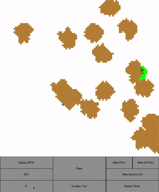
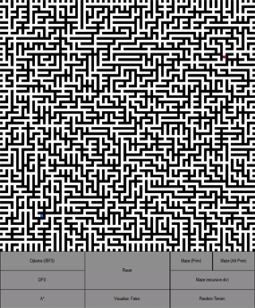

# Pygame Pathfinder

Visualise maze generation and pathfinding algorithms with Pygame.

## Installation

Clone this repo and cd into it:

```bash
git clone https://github.com/ChrisKneller/pygame-pathfinder.git
cd pygame-pathfinder
```

Create and activate your virtual environment:

* MacOS/Linux:
```bash
virtualenv --no-site-packages env
source env/bin/activate
```

* Windows:
```bash
virtualenv env
.\env\Scripts\activate
```

Install the required packages:

```bash
pip install -r requirements.txt
```

## Usage

```bash
python grid.py
```

### Buttons

Maze/terrain generation buttons are on the right.

#### Maze/terrain generation examples:

 




Pathfinding buttons are on the left.

#### Pathfinding examples:

##### Dijkstra's algorithm (equivalent to BFS in this case)

 

##### Depth first search (DFS)

 

##### A* algorithm



The visualise button is a toggle.


### Grid interaction

Left click to create a wall or move the start and end points.

Hold left <kbd>CTRL</kbd> and left click to create a sticky mud patch (which reduces movement speed to 1/3).

The point of these mud patches is to showcase Dijkstra's algorithm (first) and A* (second) by adjusting the "distances" between the nodes:




After a pathfinding algorithm has been run you can drag the start/end points around and see the visualisation update instantly for the new path using the algorithm that was last run.



## Contributing
Pull requests are welcome. For major changes, please open an issue first to discuss what you would like to change.

## License
[GPL-3.0](https://github.com/ChrisKneller/pygame-pathfinder/blob/master/LICENSE)